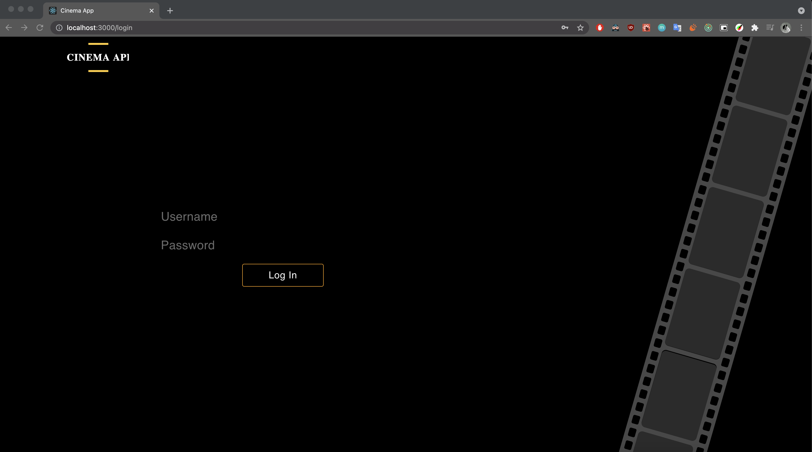
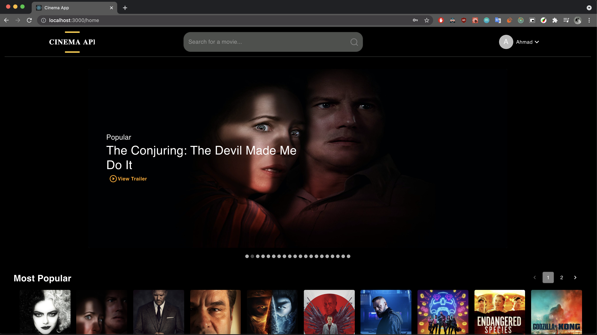

# Cinema App
This is the required application for the task, designed as instructed in the screenshots sent in the email and using [moviedb](https://www.themoviedb.org/).
<hr>

## How To Run
Open a terminal window then **cd** into the root directory of the web application then proceed to follow these steps:

1. The node dependencies must be installed first, this is done through the command: 

> npm i

1. To Run the project, use this command:
   
> npm start

<hr>

## Project Folder Structure

```
Application
│   public
│
└───src
│   │
│   └───components
│   │
│   └─── actions
│   │
│   └─── reducers
│   │
│   └─── assets
│ 
└   configuration.js
    
```

The **src** folder contains all the logic of the website. It is divided into several folders:

- Components: This folder contains the pages of the website and all the necessary components used.
- Actions: This folder contains all the redux actions used in this project.
- Reducers: This folder contains all the redux reducers used in this project.
- assets: This folder contains the provided assets in the email for the website.
- configuration.js: this file is responsible for the creation of redux store and redux persistence.

<hr>

## Pages and Routes

### Login Page
- Route: /login
- The page responsible for logging into the website and as instructed in the task description, mock data was used, so any username and password will suffice.



### Home Page
- Route: / or /home
- The page responsible for displaying the movie carousel, plus all the popular and top rated movies.




### Search Page:
- Route: /search?q=movieID
- This page is responsible for searching, it can only be accessed when the user types a query in the search bar.


<hr>

### Notes
- All the movie posters and carousel are clickable and when clicked, they play the trailer of the clicked movie in a modal.
- The carousel used is navigatable, in order to navigate it, please move the cursor to the edge of the carousel and a button will appear.
- I apologize for not implementing the footer as instructed in the screenshots as I have alot of deadlines and exams currently in university so I didn't have enough time to implement it.
